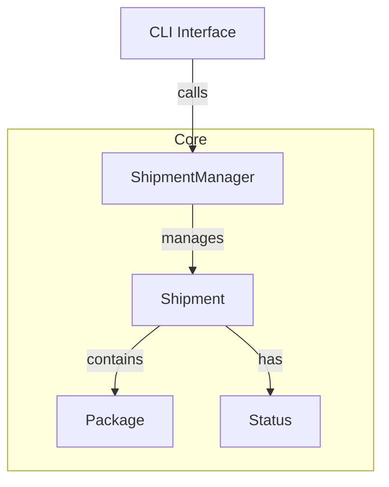

# Cargo Tracker 1.0 – Planning Document

> 
>
> **Welcome!** If you’re reading this, you’re probably here because you’re not quite sure what you’re doing. Don’t worry—this planning document will help you get started and keep you on track as you build Cargo Tracker 1.0.
---

## 🧱 Core Models

- [ ] `ShipmentStatus` enum: `Pending`, `InTransit`, `Delivered`, `Lost`
- [ ] `Package` struct: `id`, `description`
- [ ] `Shipment` struct: `tracking_id`, `destination`, `status`, `Vec<Package>`
- [ ] `ShipmentManager`: manages `HashMap<String, Shipment>`

---

## 🧩 Core Logic

- [ ] Add new shipment
- [ ] Add packages to shipment
- [ ] Update shipment status
- [ ] View shipment details
- [ ] List shipments by status

---

## 🛠️ CLI Layer

- [ ] Menu-based CLI
- [ ] Parse user input, dispatch to `ShipmentManager`
- [ ] Print readable responses

---

## 🧪 Error Handling

- [ ] Duplicate tracking IDs
- [ ] Invalid status updates
- [ ] Missing shipments

---

## 🧬 Bonus Enhancements

- [ ] Save/load data with `serde` + `serde_json`
- [ ] Add timestamps
- [ ] Pretty-print tables

---

## 📚 Rust Concepts Mapping

| Chapter | Concept                  | Project Area                             |
| ------- | ------------------------ | ---------------------------------------- |
| 4–5     | Ownership & Structs      | Shipment, Package                        |
| 6       | Enums & Pattern Matching | Status                                   |
| 7       | Modules                  | `mod models`, `mod manager`              |
| 8       | Collections              | Vec<Package>, HashMap\<String, Shipment> |
| 9       | Error Handling           | CLI & ShipmentManager interface          |

---

## 🏗️ Architectural Overview

---

## 🧠 Learning Challenge

- Did I handle ownership correctly?
- Can I refactor into smaller modules?
- Did I cover edge cases?
- How would I scale this?

---

## 📄 See Also (To Pass the workflow tests)

- [Expected Features & Outcomes](EXPECTED.md)
