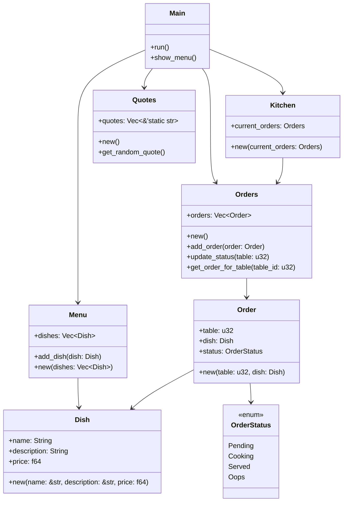

# 🧀 PLANNING.md  

_“Anyone can cook… but only the bravest can debug during dinner rush.”_

Welcome to the **Planning Scroll of Ratatui** — a magical kitchen ops log created by the legendary Chef Remy and his elite rodent dev crew (you!).


Here’s the game plan to turn chaos into cuisine.

---

## 🗺️ Project Overview

### 🍽️ Title: **ratatui**

_A tiny but mighty terminal tool to manage Remy’s restaurant operations._

Our goal is to build a simple command-line kitchen brain that can:

- 🧾 Take and track customer orders
- 📋 Keep an organized menu of magical meals
- 🍳 Monitor cooking status of dishes
- 🎩 Surprise the user with a sprinkle of chef-y charm

---

## 🧩 Modules a.k.a. “Magic Scrolls”

### 1. `menu` 🥦  
>
> The Sacred Scroll of Seasonal Delights  

- Stores dishes and their ingredients
- Can list current menu items

---

### 2. `orders` 📝  
>
> The Order Ledger of Destiny™  

- Keeps track of which table ordered what
- Supports marking orders as “in progress”, “served”, or “oops”

---

### 3. `kitchen` 🔥  
>
> The Heart of the Heat  

- Shows which orders are currently being cooked
- Lets Remy “prepare” and “complete” dishes
- Could trigger panic mode if too many orders pile up!

---

### 4. `quotes` 📜  
>
> Daily Wisdom from Chef Gusteau  

- Displays random quotes at program start
- Adds flavor (the verbal kind)

---

### 5. `main.rs` 🐀  
>
> The Head Chef  

- Orchestrates the modules
- Handles the command-line interface (simple text-based menu)
- Greets the user with charm and a Gusteau quote

---

## 🧱 Project Architecture

```
ratatui/
├── src/
│ ├── main.rs
│ ├── menu.rs
│ ├── orders.rs
│ ├── kitchen.rs
│ └── quotes.rs
├── Cargo.toml
└── PLANNING.md
```

You’ll use:

- `struct` for `Dish`, `Order`, etc.
- `enum` for order status (`Pending`, `Cooking`, `Served`, etc.)
- `match`, `if`, and basic control flow
- Basic file or in-memory store (Vec) to simulate data storage
- Modules + `mod` statements to organize the code

---

## 💡 Stretch Ideas (Optional Garnish)

- 🧅 Add persistent storage using basic file I/O (like saving orders between runs)
- 🧂 CLI arguments for fast ordering (`ratatui add-order --dish "Ratatouille" --table 4`)
- 🐭 “Surprise me” dish generator (for when Linguini panics)

---

## 🧪 MVP Checklist

- [ ] Start program with a Gusteau quote
- [ ] Show main menu: View Menu, Take Order, Cook Order, Serve Order
- [ ] Track list of dishes
- [ ] Track and update orders
- [ ] Mark order status
- [ ] Keep it modular
- [ ] Have fun doing it!

## 🗂️ UML Diagram

> _“Developer note: My idea — follow me at your own risk. Side effects may include inspiration, confusion, or spontaneous feature creep.”_



---

> 🧠 _“A kitchen is not just about cooking. It’s about love, chaos, and a really good system.” — Remy (probably)_

---

## 🍽️ See It In Action

Curious how Remy’s kitchen magic looks in the terminal? Check out [EXPECTED.md](./EXPECTED.md) for a taste of the CLI experience — sample commands, outputs, and a dash of chef-y flair. Bon appétit!
